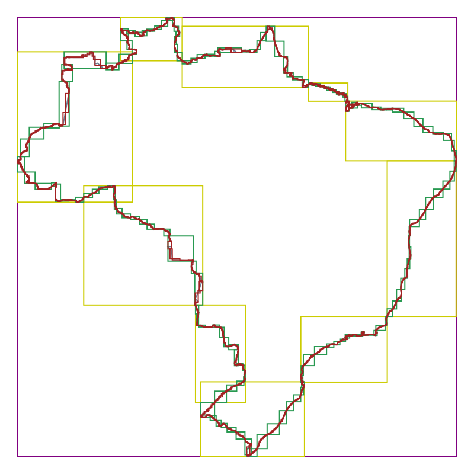
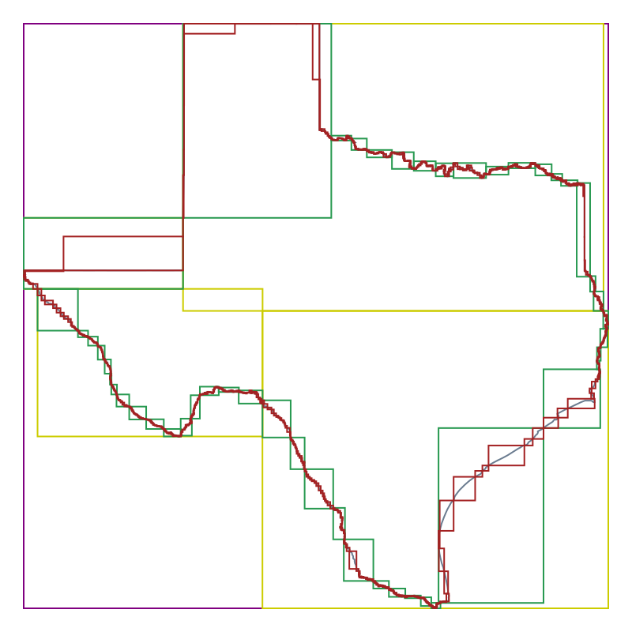
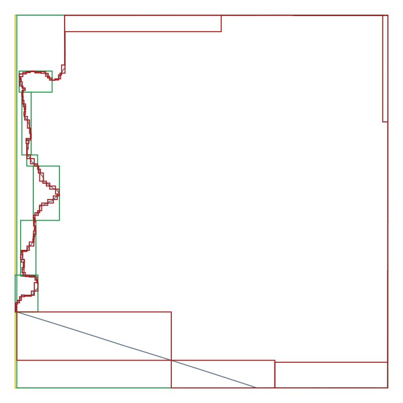
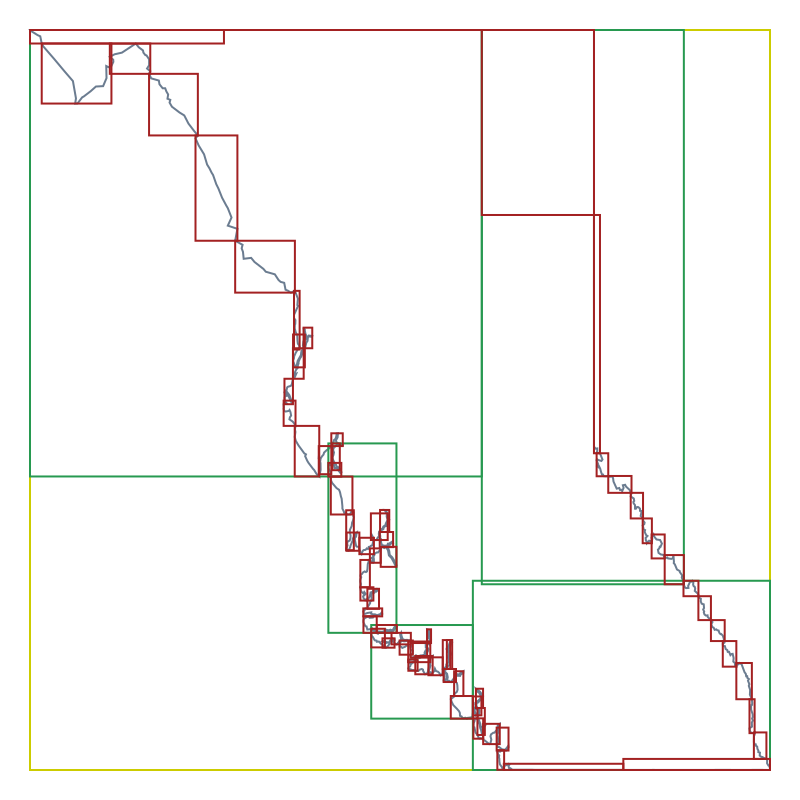
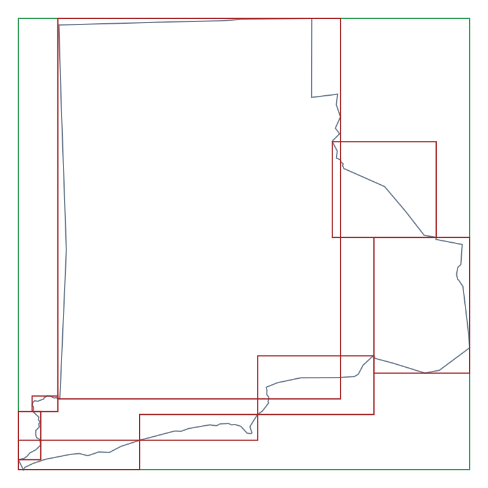
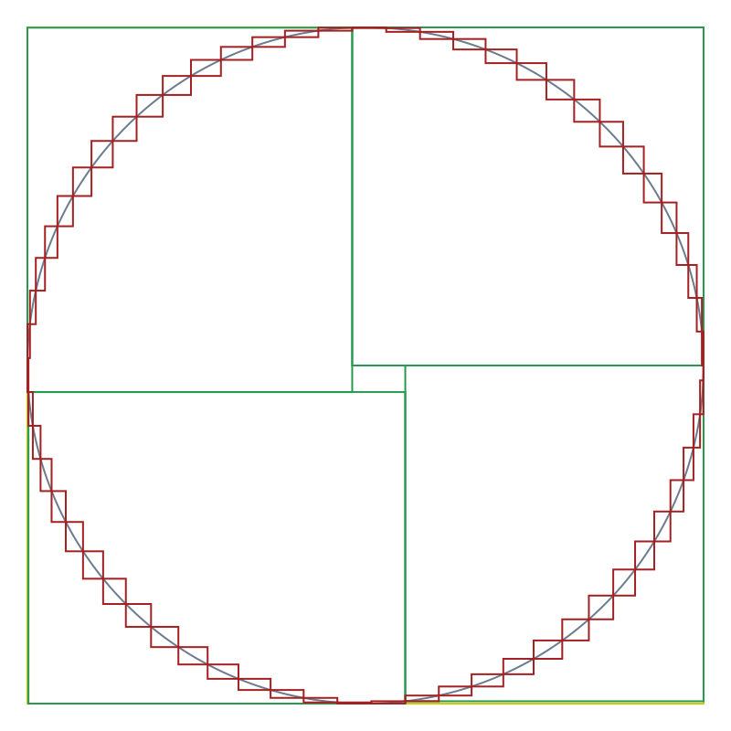
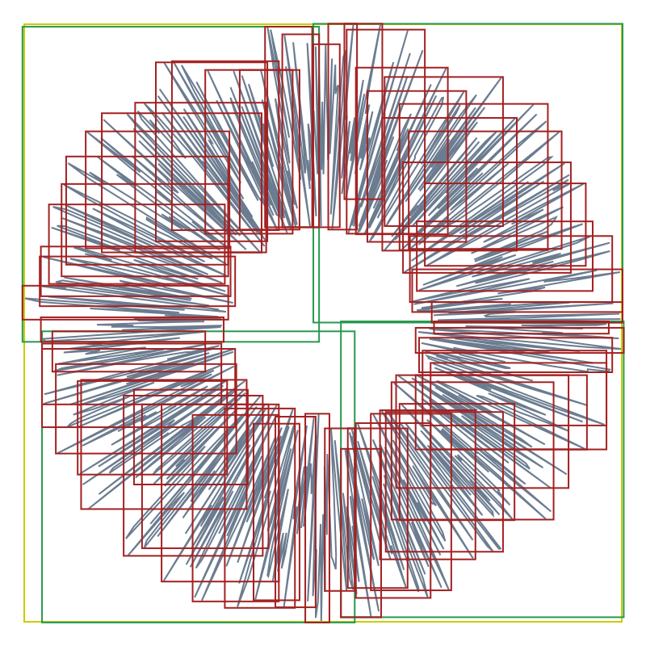
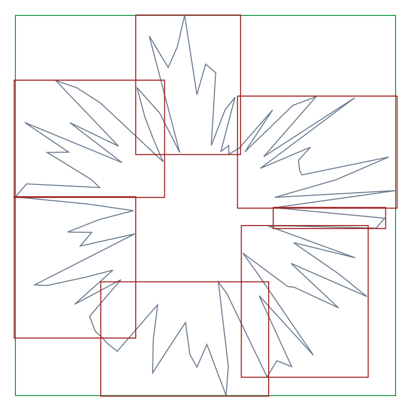

# Benchmarks

Here are some benchmarks that measure the performance of the [TG](https://github.com/tidwall/tg) library.

- Creating geometries
- Point-in-polygon
- Line segment intersection
- Parsing and writing GeoJSON, WKT, WKB, and Hex
- Memory usage
- [Natural](POLYGON_INDEXING.md#natural) and [YStripes](POLYGON_INDEXING.md#ystripes) indexing
- Comparison with the [GEOS](https://github.com/libgeos/geos) library

To run these locally:

```bash
tests/run.sh bench              # run all benchmarks
tests/run.sh bench pip          # only point-in-polygon benchmarks
tests/run.sh bench pip_simple   # only the simple point-in-polygon benchmarks
tests/run.sh bench intersects   # only intersects benchmarks
tests/run.sh bench io           # only parsing and writing benchmarks
GEOS_BENCH=1 tests/run.sh bench # include the GEOS library in benchmarks for comparison
```

<div align="center"
></div>

<div align="center">
<sup>
<i>Examples of polygons with natural indexing:</i>
<br>
<i>Brazil, Texas, Arizona, British Columbia, Rhode Island, Circle-1000,
Random-1000, Random-100</i>
</sup>
</div>

---
<pre>
$ GEOS_BENCH=1 tests/run.sh bench
CC: cc
CFLAGS: -O3
OS: Linux
CPU: AMD Ryzen 9 5950X 16-Core Processor
Compiler: x86_64-linux-gnu-gcc-11 (Ubuntu 11.4.0-1ubuntu1~22.04) 11.4.0
TG Commit: d29ef5c
GEOS: 3.12.0-9136cb0
BENCHMARKING...
cc -O3 -DGEOS_BENCH -Ilibgeos/build/install/include bmalloc.c ../tg.c  \
    bench.c -lm bmalloc.cpp libgeos/build/install/lib/libgeos_c.a  \
    libgeos/build/install/lib/libgeos.a -lm -pthread -lstdc++
SEED=3276435090158169547
RUNS=10

<b>== Point-in-polygon ==</b>
Benchmark point-in-polygon operation for 10K random points that
are each within the polygon's MBR with an extra 10% padding.
Performs 10 runs and chooses the best results.

<b>Brazil              ops/sec    ns/op  points  hits       built      bytes</b>
tg/none              96,944    10315   39914  3257    46.73 µs    638,720
tg/natural       10,143,419       99   39914  3257    53.17 µs    681,360
tg/ystripes      15,174,761       66   39914  3257   884.06 µs  1,059,548
geos/none            29,708    33661   39914  3257   135.18 µs    958,104
geos/prepared     7,885,512      127   39914  3257  2059.94 µs  3,055,496

<b>Texas               ops/sec    ns/op  points  hits       built      bytes</b>
tg/none             298,569     3349   12478  3243    15.97 µs    199,744
tg/natural       12,129,277       82   12478  3243    17.40 µs    213,136
tg/ystripes      22,453,447       45   12478  3243   291.35 µs    355,548
geos/none            95,314    10492   12478  3243    37.19 µs    299,640
geos/prepared     9,868,950      101   12478  3243   559.57 µs    824,168

<b>Arizona             ops/sec    ns/op  points  hits       built      bytes</b>
tg/none           2,303,044      434    1582  6134     3.10 µs     25,408
tg/natural       21,754,688       46    1582  6134     3.81 µs     27,152
tg/ystripes      36,535,749       27    1582  6134    32.42 µs     57,996
geos/none           968,974     1032    1582  6134     5.96 µs     38,136
geos/prepared    16,288,559       61    1582  6134    48.64 µs    103,912

<b>Br Columbia         ops/sec    ns/op  points  hits       built      bytes</b>
tg/none           2,799,001      357    1148  3132     2.15 µs     18,464
tg/natural       16,364,822       61    1148  3132     3.58 µs     19,744
tg/ystripes      20,805,079       48    1148  3132    24.08 µs     29,660
geos/none           966,474     1035    1148  3132     6.20 µs     27,720
geos/prepared    13,332,180       75    1148  3132    60.32 µs     93,496

<b>Rhode Island        ops/sec    ns/op  points  hits       built      bytes</b>
tg/none          16,076,289       62     124  4428     1.60 µs      2,080
tg/natural       28,532,680       35     124  4428     1.91 µs      2,240
tg/ystripes      38,269,197       26     124  4428     4.05 µs      4,412
geos/none         5,196,114      192     124  4428     1.43 µs      3,144
geos/prepared    22,622,998       44     124  4428    11.44 µs      7,896

<b>Circle-50           ops/sec    ns/op  points  hits       built      bytes</b>
tg/none          23,550,275       42      50  5478     1.19 µs        896
tg/natural       29,330,797       34      50  5478     1.67 µs        992
tg/ystripes      37,349,100       27      50  5478     3.58 µs      2,348
geos/none         6,943,062      144      50  5478     1.43 µs      1,368
geos/prepared    24,657,871       41      50  5478     7.63 µs      3,656

<b>Circle-100          ops/sec    ns/op  points  hits       built      bytes</b>
tg/none          17,310,375       58     100  5530     1.19 µs      1,696
tg/natural       28,610,532       35     100  5530     1.67 µs      1,840
tg/ystripes      38,586,053       26     100  5530     3.58 µs      4,596
geos/none         5,416,198      185     100  5530     1.67 µs      2,568
geos/prepared    22,429,433       45     100  5530    10.01 µs      6,904

<b>Circle-1000         ops/sec    ns/op  points  hits       built      bytes</b>
tg/none           3,399,776      294    1000  5502     2.62 µs     16,096
tg/natural       18,616,529       54    1000  5502     3.58 µs     17,216
tg/ystripes      38,164,731       26    1000  5502    18.60 µs     45,172
geos/none         1,092,551      915    1000  5502     6.68 µs     24,168
geos/prepared    17,203,872       58    1000  5502    55.79 µs     60,056

<b>Circle-10000        ops/sec    ns/op  points  hits       built      bytes</b>
tg/none             382,304     2616   10000  5452    17.40 µs    160,096
tg/natural       14,251,797       70   10000  5452    20.50 µs    170,848
tg/ystripes      32,214,316       31   10000  5452   154.97 µs    450,804
geos/none           119,706     8354   10000  5452    28.37 µs    240,168
geos/prepared    12,101,281       83   10000  5452   521.90 µs    764,696

<b>Random-50           ops/sec    ns/op  points  hits       built      bytes</b>
tg/none          17,682,563       57      50  2807     1.24 µs        896
tg/natural       22,944,770       44      50  2807     1.43 µs        992
tg/ystripes      23,484,344       43      50  2807     3.10 µs      2,372
geos/none         6,782,509      147      50  2807     1.67 µs      1,368
geos/prepared    17,425,442       57      50  2807     7.39 µs      3,656

<b>Random-100          ops/sec    ns/op  points  hits       built      bytes</b>
tg/none          11,491,243       87     100  2608     1.19 µs      1,696
tg/natural       18,468,974       54     100  2608     1.67 µs      1,840
tg/ystripes      17,623,126       57     100  2608     4.29 µs      3,812
geos/none         4,869,171      205     100  2608     1.91 µs      2,568
geos/prepared    12,725,436       79     100  2608    10.01 µs      6,904

<b>Random-1000         ops/sec    ns/op  points  hits       built      bytes</b>
tg/none           1,299,874      769    1000  2468     2.38 µs     16,096
tg/natural        3,374,610      296    1000  2468     3.10 µs     17,216
tg/ystripes       2,880,109      347    1000  2468    27.42 µs     31,260
geos/none           669,385     1494    1000  2468     8.11 µs     24,168
geos/prepared     1,365,244      732    1000  2468    67.23 µs     60,056

<b>Random-10000        ops/sec    ns/op  points  hits       built      bytes</b>
tg/none             112,685     8874   10000  2298    12.64 µs    160,096
tg/natural          262,932     3803   10000  2298    15.02 µs    170,848
tg/ystripes         290,156     3446   10000  2298   320.91 µs    306,348
geos/none            63,730    15691   10000  2298    47.45 µs    240,168
geos/prepared       120,078     8328   10000  2298   669.48 µs    764,696

<b>== Line intersect ==</b>
Benchmark line intersecting polygon operation for 10K random line
segments that are each no larger than 10% the width of the polygon
and are within the polygon's MBR plus an extra 10% padding.
Performs 10 runs and chooses the best results.

<b>Brazil              ops/sec    ns/op  points  hits       built      bytes</b>
tg/none              27,393    36505   39914  5482    48.40 µs    638,720
tg/natural        2,025,548      494   39914  5482    58.65 µs    681,360
tg/ystripes       2,360,195      424   39914  5482   898.12 µs  1,059,548
geos/none             1,633   612174   39914  5482   106.57 µs    958,104
geos/prepared     1,033,334      968   39914  5482  2002.00 µs  3,055,496

<b>Texas               ops/sec    ns/op  points  hits       built      bytes</b>
tg/none              85,207    11736   12478  5498    13.83 µs    199,744
tg/natural        3,487,406      287   12478  5498    19.31 µs    213,136
tg/ystripes       4,838,278      207   12478  5498   303.51 µs    355,548
geos/none             4,859   205794   12478  5498    32.19 µs    299,640
geos/prepared     2,102,935      476   12478  5498   576.26 µs    824,168

<b>Arizona             ops/sec    ns/op  points  hits       built      bytes</b>
tg/none           1,213,348      824    1582  9148     2.38 µs     25,408
tg/natural       11,545,015       87    1582  9148     3.58 µs     27,152
tg/ystripes      17,281,845       58    1582  9148    32.66 µs     57,996
geos/none           320,391     3121    1582  9148     5.01 µs     38,136
geos/prepared     7,595,624      132    1582  9148    48.88 µs    103,912

<b>Br Columbia         ops/sec    ns/op  points  hits       built      bytes</b>
tg/none             797,138     1254    1148  5287     1.91 µs     18,464
tg/natural        5,992,718      167    1148  5287     2.86 µs     19,744
tg/ystripes       7,455,215      134    1148  5287    25.03 µs     29,660
geos/none            92,491    10812    1148  5287     3.81 µs     27,720
geos/prepared     4,507,580      222    1148  5287    46.49 µs     93,496

<b>Rhode Island        ops/sec    ns/op  points  hits       built      bytes</b>
tg/none           6,161,751      162     124  7119     0.95 µs      2,080
tg/natural       14,027,772       71     124  7119     1.67 µs      2,240
tg/ystripes      16,558,641       60     124  7119     3.34 µs      4,412
geos/none           943,770     1060     124  7119     1.43 µs      3,144
geos/prepared     8,683,859      115     124  7119     9.78 µs      7,896

<b>Circle-100          ops/sec    ns/op  points  hits       built      bytes</b>
tg/none           8,263,010      121     100  8311     1.00 µs      1,696
tg/natural       14,857,612       67     100  8311     1.19 µs      1,840
tg/ystripes      18,699,527       53     100  8311     3.81 µs      4,596
geos/none         2,353,177      425     100  8311     1.43 µs      2,568
geos/prepared     9,852,722      101     100  8311     8.11 µs      6,904

<b>Circle-1000         ops/sec    ns/op  points  hits       built      bytes</b>
tg/none           1,545,945      647    1000  8342     1.91 µs     16,096
tg/natural        9,580,411      104    1000  8342     3.10 µs     17,216
tg/ystripes      16,545,577       60    1000  8342    18.36 µs     45,172
geos/none           560,151     1785    1000  8342     3.58 µs     24,168
geos/prepared     7,264,121      138    1000  8342    36.72 µs     60,056

<b>Circle-10000        ops/sec    ns/op  points  hits       built      bytes</b>
tg/none             169,751     5891   10000  8311    17.17 µs    160,096
tg/natural        5,744,834      174   10000  8311    20.50 µs    170,848
tg/ystripes       8,566,797      117   10000  8311   163.56 µs    450,804
geos/none            64,297    15553   10000  8311    28.61 µs    240,168
geos/prepared     3,221,926      310   10000  8311   507.35 µs    764,696

<b>Random-100          ops/sec    ns/op  points  hits       built      bytes</b>
tg/none          11,834,943       84     100  2345     1.34 µs      1,696
tg/natural       17,901,425       56     100  2345     1.91 µs      1,840
tg/ystripes      17,939,709       56     100  2345     4.29 µs      3,716
geos/none         4,692,140      213     100  2345     1.91 µs      2,568
geos/prepared    12,542,775       80     100  2345     8.58 µs      6,904

<b>Random-1000         ops/sec    ns/op  points  hits       built      bytes</b>
tg/none           1,272,080      786    1000  2289     2.15 µs     16,096
tg/natural        3,298,186      303    1000  2289     3.10 µs     17,216
tg/ystripes       2,798,254      357    1000  2289    28.13 µs     31,612
geos/none           652,891     1532    1000  2289     4.05 µs     24,168
geos/prepared     1,340,076      746    1000  2289    45.30 µs     60,056

<b>Random-10000        ops/sec    ns/op  points  hits       built      bytes</b>
tg/none             113,505     8810   10000  2278    17.17 µs    160,096
tg/natural          265,475     3767   10000  2278    19.07 µs    170,848
tg/ystripes         291,795     3427   10000  2278   329.26 µs    307,116
geos/none            64,085    15604   10000  2278    48.40 µs    240,168
geos/prepared       120,187     8320   10000  2278   673.77 µs    764,696

<b>== I/O ==</b>
Benchmark reading and writing polygons from various formats.
Performs 10 runs and chooses the average.

<b>Brazil              ops/sec    ns/op  MB/sec</b>
tg/wkb/read          28,320    35310   17249
tg/wkb/write         20,982    47660   12779
tg/hex/read           2,138   467515    2605
tg/hex/write          1,308   764370     797
tg/wkt/read             189  5268335     154
tg/wkt/write            283  3525686     173
tg/json/read            151  6611919     134
tg/json/write           284  3509903     174
geos/wkb/read         3,150   317430    1919
geos/wkb/write          833  1199269     508
geos/hex/read            48 20737457      59
geos/hex/write           54 18469691      33
geos/wkt/read           118  8452296      96
geos/wkt/write          205  4875159     125
geos/json/read           64 15405059      58
geos/json/write         124  8047152      76

<b>Texas               ops/sec    ns/op  MB/sec</b>
tg/wkb/read          99,391    10061   18925
tg/wkb/write        242,445     4125   46164
tg/hex/read           6,921   144482    2636
tg/hex/write          4,456   224400     849
tg/wkt/read             593  1685023     150
tg/wkt/write            896  1115942     171
tg/json/read            451  2216625     124
tg/json/write           896  1114845     171
geos/wkb/read        10,212    97919    1945
geos/wkb/write        3,559   280952     678
geos/hex/read           164  6081295      63
geos/hex/write          195  5124617      37
geos/wkt/read           400  2495718     101
geos/wkt/write          678  1474404     129
geos/json/read          206  4837084      57
geos/json/write         408  2446246      78

<b>Arizona             ops/sec    ns/op  MB/sec</b>
tg/wkb/read         635,500     1574   15348
tg/wkb/write      1,747,626      572   42208
tg/hex/read          54,542    18334    2635
tg/hex/write         34,807    28729     841
tg/wkt/read           4,512   221610     148
tg/wkt/write          7,147   139904     173
tg/json/read          3,560   280857     128
tg/json/write         7,189   139093     174
geos/wkb/read        78,840    12684    1904
geos/wkb/write       27,795    35977     671
geos/hex/read         1,315   760078      64
geos/hex/write        1,552   644183      37
geos/wkt/read         3,163   316143     104
geos/wkt/write        5,422   184417     131
geos/json/read        1,606   622559      58
geos/json/write       3,217   310826      78

<b>Br Columbia         ops/sec    ns/op  MB/sec</b>
tg/wkb/read         806,596     1240   14139
tg/wkb/write      2,207,528      453   38697
tg/hex/read          73,973    13518    2593
tg/hex/write         41,775    23937     732
tg/wkt/read           6,433   155425     150
tg/wkt/write          9,894   101066     173
tg/json/read          4,827   207162     124
tg/json/write        10,024    99754     176
geos/wkb/read       107,271     9322    1880
geos/wkb/write       37,617    26584     659
geos/hex/read         1,818   549936      64
geos/hex/write        2,138   467539      37
geos/wkt/read         4,282   233483     100
geos/wkt/write        7,475   133777     131
geos/json/read        2,225   449252      57
geos/json/write       4,265   234437      75

<b>Rhode Island        ops/sec    ns/op  MB/sec</b>
tg/wkb/read       2,796,202      358    5325
tg/wkb/write      8,388,608      119   15976
tg/hex/read         566,797     1764    2159
tg/hex/write        427,990     2337     815
tg/wkt/read          57,221    17476     141
tg/wkt/write         92,589    10800     176
tg/json/read         43,827    22817     119
tg/json/write        91,180    10967     174
geos/wkb/read       806,596     1240    1536
geos/wkb/write      285,326     3505     543
geos/hex/read        16,461    60749      63
geos/hex/write       19,418    51498      37
geos/wkt/read        39,162    25535      97
geos/wkt/write       66,260    15092     126
geos/json/read       19,065    52452      52
geos/json/write      36,503    27394      70
</pre>