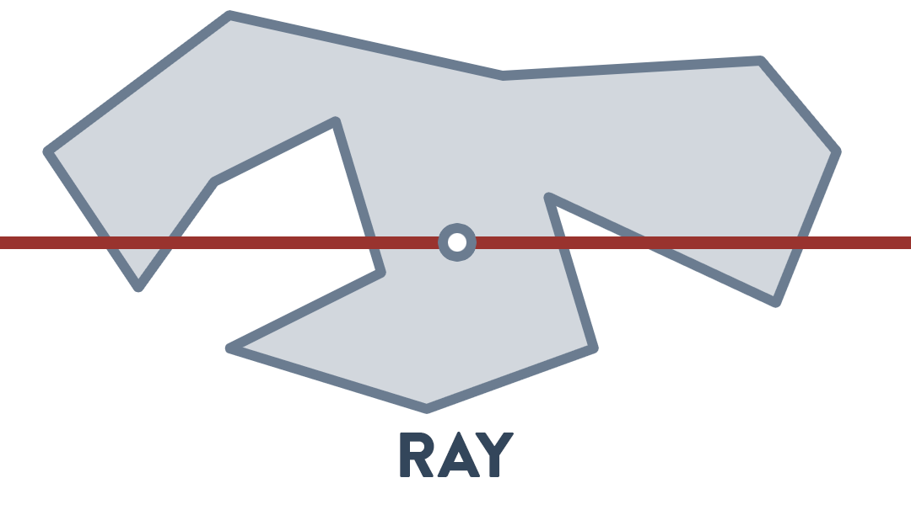
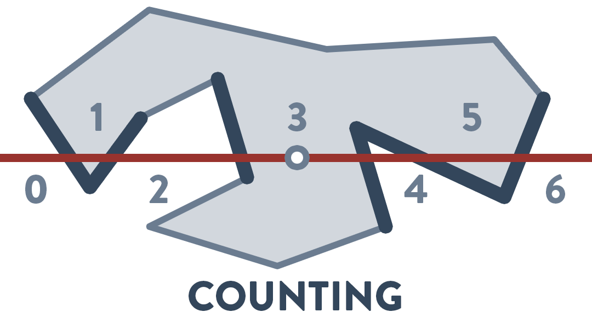
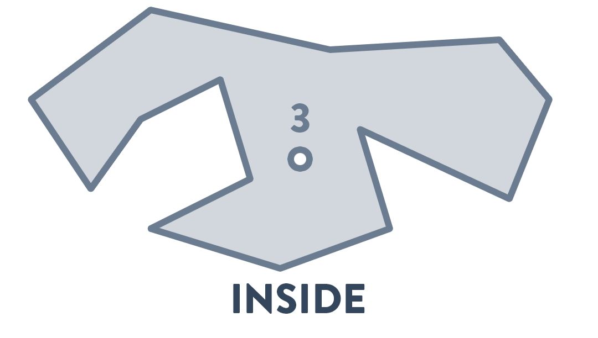
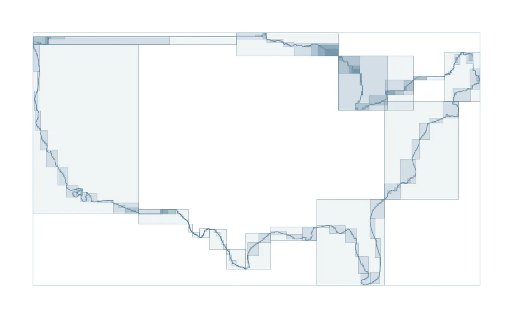
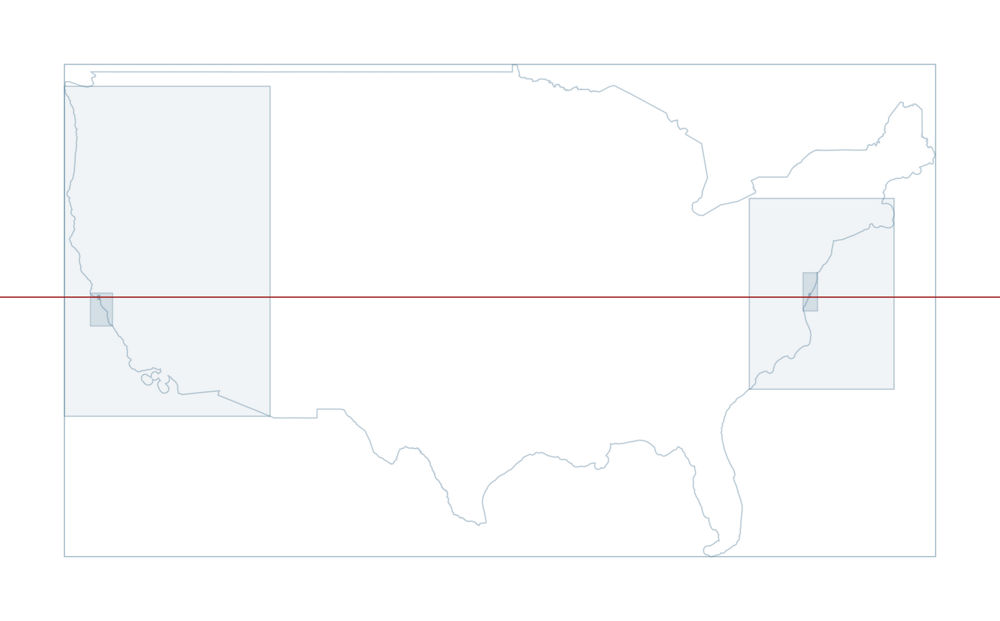
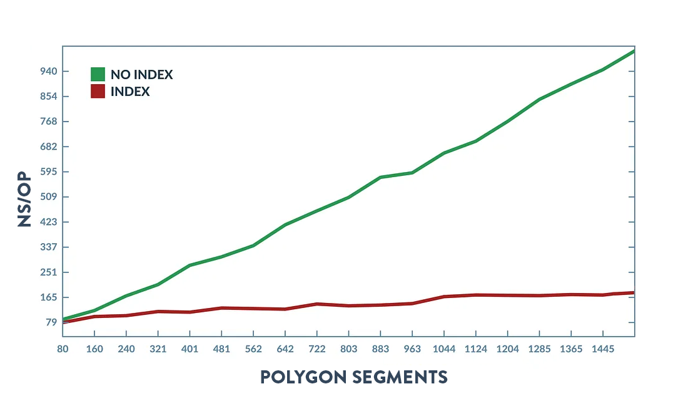
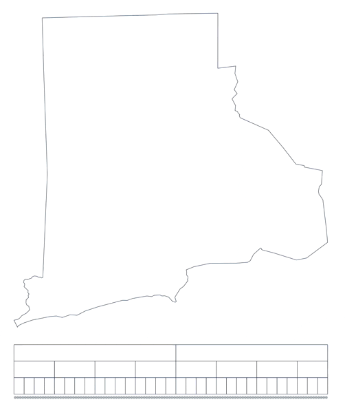
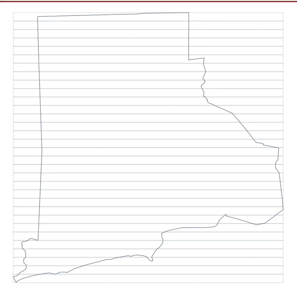

# Polygon indexing

There are two kinds of polygon index structures used in [TG](https://github.com/tidwall/tg).
I call them [Natural](#natural) & [YStripes](#ystripes). They make [spatial relation](https://en.wikipedia.org/wiki/Spatial_relation) operations very fast.

Here I'll mostly focus on how these index structures improve the "intersects" binary spatial predicate operation, specifically for point-in-polygon performance, but other operations such as "covers", "contains", "touches", etc. will benefit too.

## Point-in-polyon

TG uses the [ray casting](https://en.wikipedia.org/wiki/Point_in_polygon) algorithm to find if a point is inside or outside of a polygon.

This algorithm works by scanning each line segment in a polygon and detecting which of those segments intersect the "ray". The ray is just an imaginary line that extends infinitely on the X axis and has the same Y coordinate as the point. For each intersecting line segment, the point is tested to see if it's on the right side the segment, counting along the way. If the  count is an odd number then the point is inside the polygon, otherwise the point is outside.

<div
></div>

The biggest issue with this operation is that *every* line segment in a polygon must be scanned in search of intersections, even though only a few will actually intersect. For a small polygon it's usually pretty fast, but for a large polygon it gets increasingly slower.

## The R-tree

To make it a ton faster we can index the line segments by storing them in an [R-tree](https://en.wikipedia.org/wiki/R-tree). Then instead of scanning every segment, we'll do a targeted search for only the segments that intersect the ray.

<div
></div>

The speedup can be dramatic. Effectively turning an O(n) operation into an [O(log n)](https://en.wikipedia.org/wiki/Big_O_notation).



Yet the downside of straight-up using an R-tree in its traditional format is that the construction time is slow and the index can use a lot of memory.

This is because constructing an R-tree usually requires organizing the segments in such a way to make for efficent searching. This organizing usually consists of sorting the segments into leaf nodes and creating subsequent branch nodes. Sorting is slow, and storing all this node data will result in a lot of extra memory being used. Sometimes more than double the size of the original polygon itself.

The next two sections introduce the [Natural](#natural) and [YStripes](#ystripes) structures, and address the issue of construction time, memory usage, and search performance.

## Natural

The Natural structure resembles an R-tree except that the rectangles are stored in a contiguous multi-level format instead of being in a tree of nodes. And only the branch rectangles are stored in memory, while the leaf level simply shares the same memory-backed array as the polygon segments, thus keeping in their "natural" order.
This significantly reduces the overall memory size of the index. The entire Natural index is only about 7% the memory size of its original polygon.



Construction of the index is quick and easy because the memory size of the index and the number of rectangles per level can be calculated before processing the segments. Then all indexed rectangles can be inflated in a single pass of the segments, filling the memory along the way. This allows for construction of more than 10GB per second of point data on modern hardware.

Searching the index is super fast, sometimes even faster than the traditional R-tree structure. This performance is directly related to the polygon already having its segments spatially ordered, which bodes well for most spatial relation operations, including the [k-nearest neighbors](https://en.wikipedia.org/wiki/K-nearest_neighbors_algorithm) (kNN) algorithm. It also helps that the leaf level shares the same memory as the polygon segment array, in-turn reducing memory reads and easing the stress on the CPU cache.

With Natural indexing, a large polygon that has over 10K points can be indexed in under a 100 microseconds, perform over 10 million point-in-polygon operations per second while using less than 7% of additional memory. <sup>[[benchmarks](BENCHMARKS.md)]</sup>

This make Natural indexing efficient enough, by default, for general purpose use with all polygons.

## YStripes

The YStripes structure stores the offsets of each polygon segment in a [hash table](https://en.wikipedia.org/wiki/Hash_table)-like header that has a predefined number of "stripes" that are evenly distributed on the y-axis. These stripes act similar to hash table buckets, where each stripe points to a location in memory that has a list of segments that intersect with that specific stripe. This provides O(1) lookup times when doing y-intersects on segments, making for exceptionally quick point-in-polygon operations. It's about 50% faster than Natural for point-in-polygon. <sup>[[benchmarks](BENCHMARKS.md)]</sup>



There are tradeoffs with using the YStripes structure. For one, it uses much more memory than the Natural structure, and the overall size of the index is about 50% the memory size of the original polygon. Second, the construction time of YStripes is much much slower than Natural, around 20 times slower. Lastly, YStripes work best with y-intersect operations, like point-in-polygon, but not as well for the operations that require multi-axis intersecting, like geometry intersect detection and nearest neighbor.

It's acceptable to index a polygon with both YStripes and Natural. This allows for using YStripes when peak performance is needed for point-in-polygon, and using Natural for other spatial relation operations.

#### Determining the number of stripes

The number of stripes in the index is determined by the number of segments that the polygon has and the complexity of the polygon. Use the [polsby-popper test](https://en.wikipedia.org/wiki/Polsby–Popper_test) to get the complexity score. The score is calculated by multiplying the polygon area by 4pi and dividing by the perimeter squared. A perfect circle has a score of 1 and all other shapes will have a smaller score. The score is then multiplied by the number of segments, and finally the result is clamped to ensure that there's a sane minimum value.

```go
calc_num_stripes(num_segs, perim, area) {
  score := 0
  if (perim > 0) {
    score = (area * PI * 4) / (perim * perim);
  }
  num_stripes := max(num_segs * score, 32);
  return num_stripes
}
```

## Conclusions

The Natural structure is small enough and fast enough to be used broadly and automatically. In TG, all polygons with at least 32 points are indexed by default.

The YStripes structure should be used sparingly and only when peak performance for point-in-polygon is needed.

---

#### For more information

- [API reference](API.md)
- [Benchmarks](BENCHMARKS.md)
- [Project README](https://github.com/tidwall/tg)

